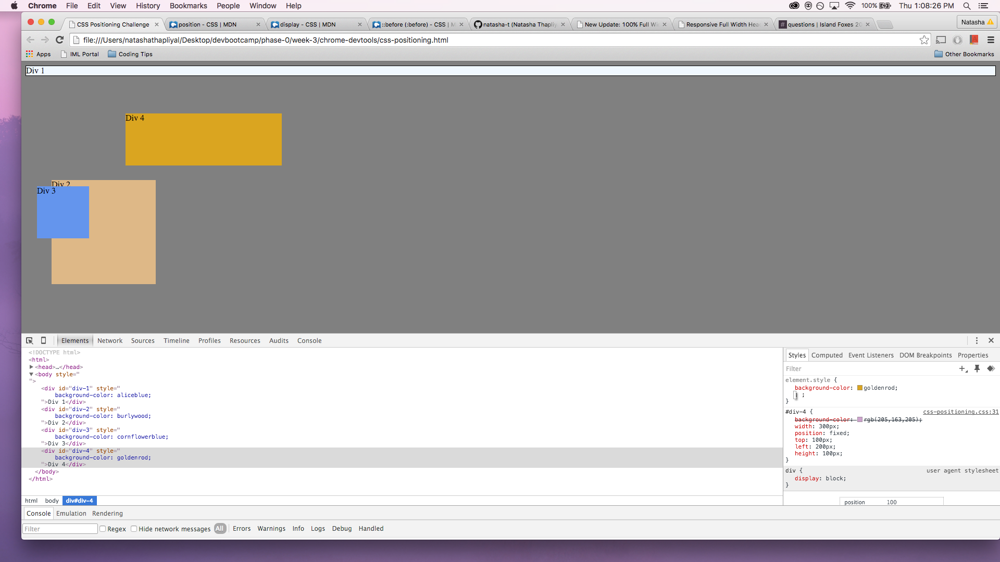
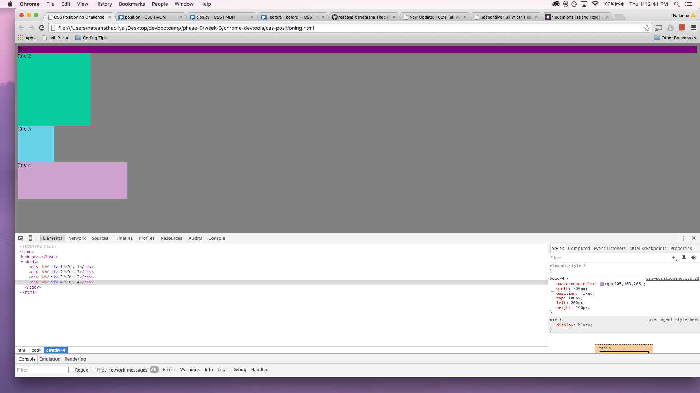
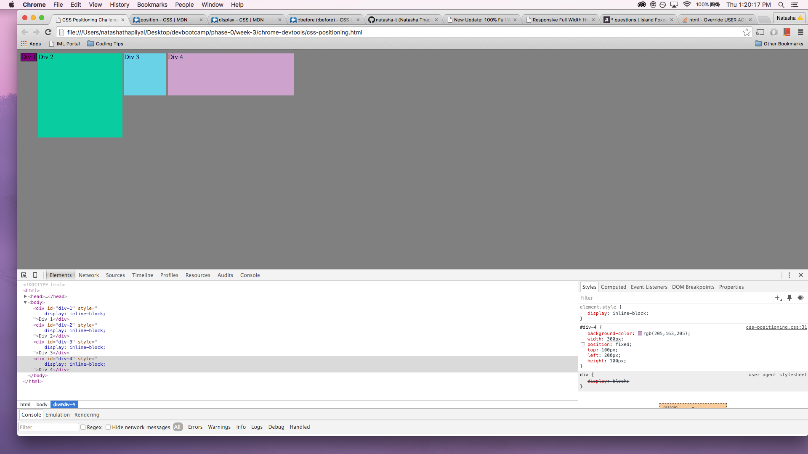
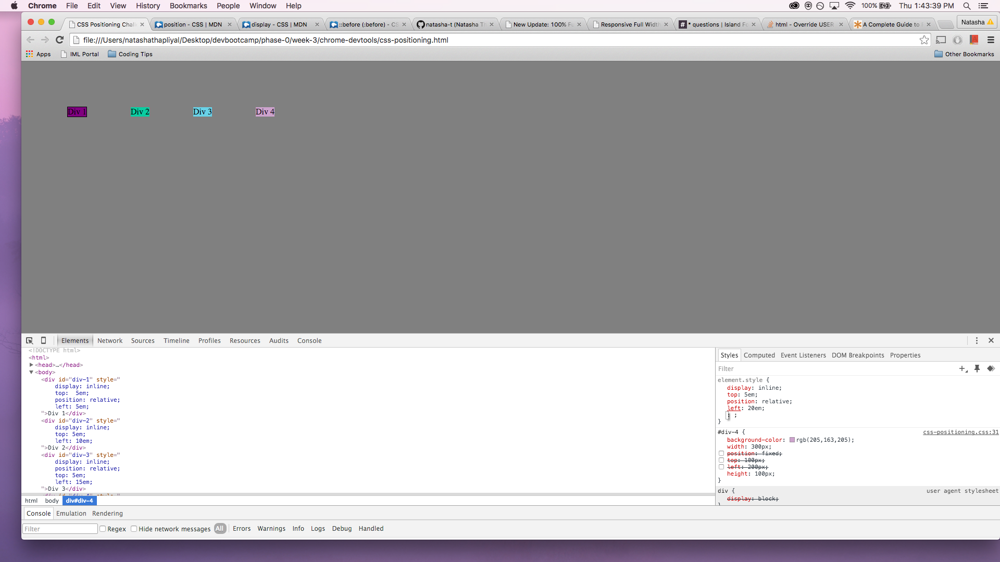
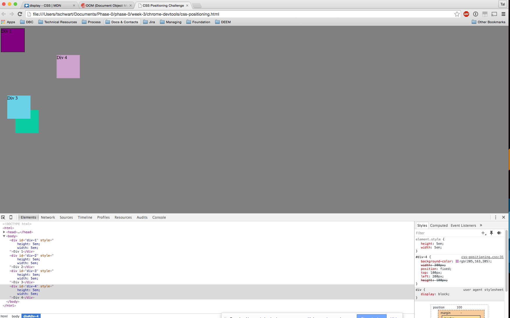
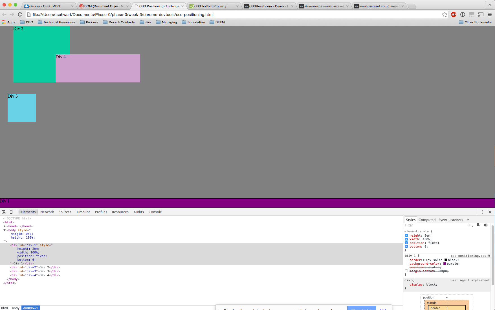
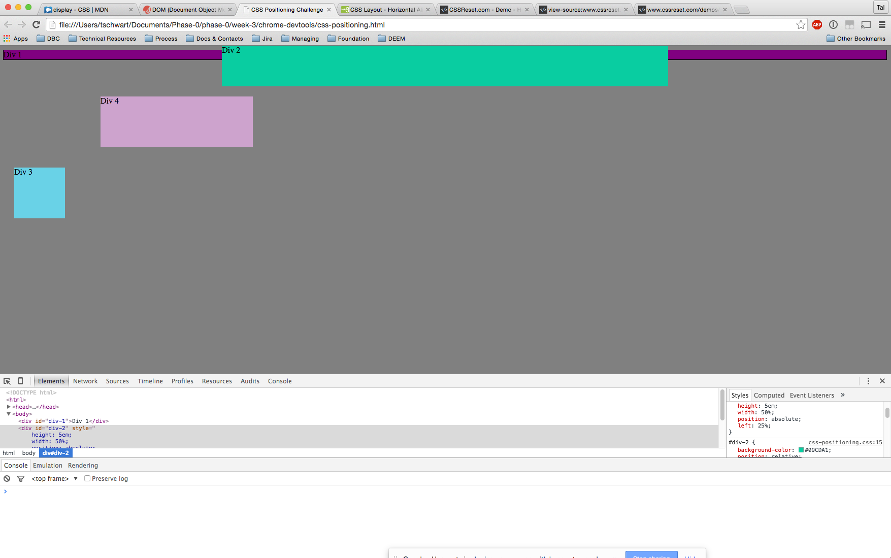
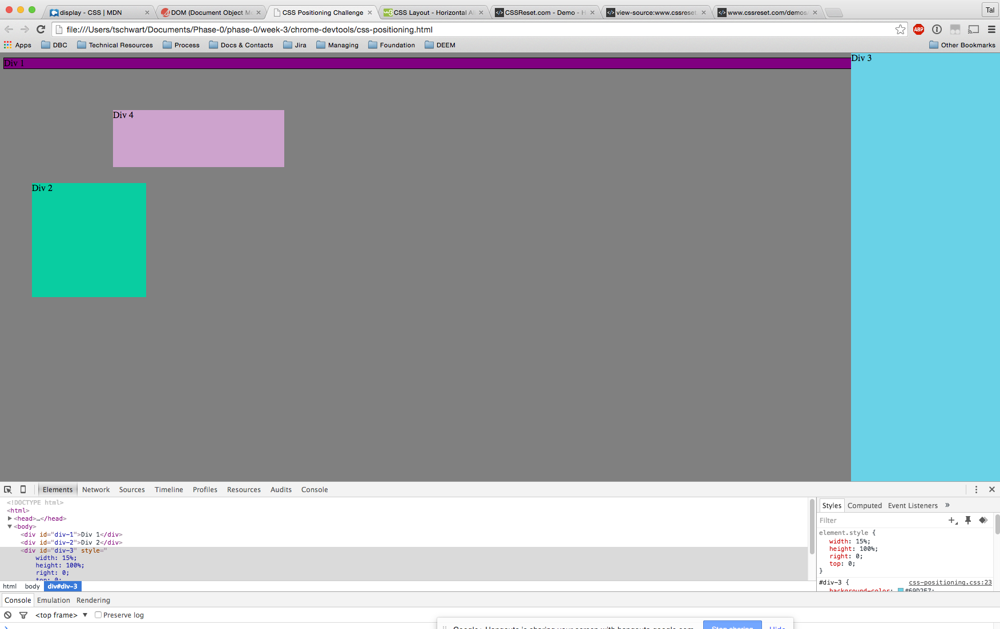
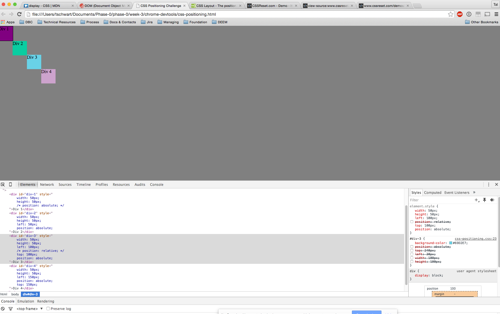

How can you use Chrome's DevTools inspector to help you format or position elements?
	Chrome's DevTools gives a surprisingly easy to use interface to examine element by element the css selectors being used, the properties being modified and the value that each is set to. It presents the defaults set by the browser "User Agent" and the styling contained in any referenced external CSS files. Those externally defined styles can be turned off indivudally by checking a box. Finally it lets you modify the CSS for that element with the element.style window. Changes are immediately reflected in the browser window and the auto-fill suggestions are pretty good. 
How can you resize elements on the DOM using CSS?

What are the differences between Absolute, Fixed, Static, and Relative positioning? Which did you find easiest to use? Which was most difficult?
	This is something we spent a bunch of time puzzling about during the pair programming sesssion. I'm still pretty fuzzy about it, in particular the interaction between siblings was surprising when changing the Positioning values. Anyway, the 
		Static = position is determined by position in the code and rendered in order
		Absolute = position is defined relative to the nearest non-static ancestor element
		Fixed = position is defined relative to the browser window, ignoring the other elements
		Relative = position is defined as an off-set from the static position

What are the differences between Margin, Border, and Padding?
Margin, Border and Padding are nested zones around an element where the Border is a displayed item (if so defined), Padding is the distance between the element and Border, and Margin is the distance from the Border to where the next element may begin. Both Margin and Padding are transparent. 

	Element --Padding-- > Border --Margin --> Position

	Element1 --Padding-- > Border --Margin --> Position --Margin--> Border --Padding--> Element2

What was your impression of this challenge overall? (love, hate, and why?)
	Really interesting challenge, it was nice to play with tags that we'd already learned and mix in brand new ones in the service of trying to solve little puzzles. Made very clear that there are multiple legitimate ways to achieve the desired visual outcomes. Some solutions were cleaner than others, but quick and dirty were substantially quicker to a working solution in many cases. 